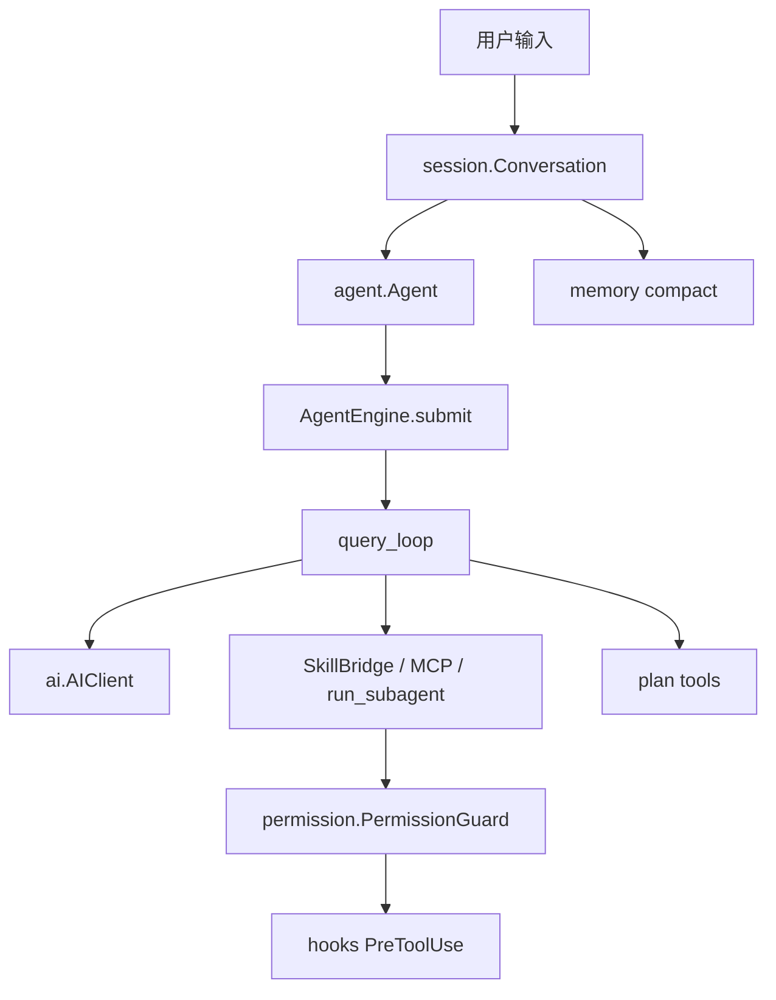

# SelfAgent 技术文档（初学者）

本目录说明 **main 通用核心** 的运行原理与模块分工。桌面产品线文档在 `app` 分支的 `docs/desktop-ts.md`。

## 建议阅读顺序

1. [整体架构](architecture.md) — 一次请求如何跑完
2. [Agent 热路径](agent.md) — `query_loop`（核心循环）
3. [Session 会话](session.md) — 多轮对话与取消
4. [Skills 工具](skills.md) — 模型能调用什么
5. [Permission 权限](permission.md) — 工具何时允许执行
6. [Plan 规划](plan.md) — 先规划再执行
7. [Memory 记忆](memory.md) — 上下文压缩与落盘记忆
8. [Workflow 工作流](workflow.md) — 计划落地与编排
9. [MCP 外部工具](mcp.md) — 接入外部 stdio 工具
10. [Hooks 钩子](hooks.md) — 生命周期扩展与拦截
11. [Subagent 子代理](subagent.md) — 隔离子任务
12. [Log 日志](log.md) — 调试与追踪
13. [AI 客户端](ai.md) — 模型调用抽象

## 一张图记住主链路

配置样例：仓库根目录 [`config.example.yaml`](../config.example.yaml)。  
动手示例：[`examples/quickstart.py`](../examples/quickstart.py)、[`examples/chat_session.py`](../examples/chat_session.py)。
