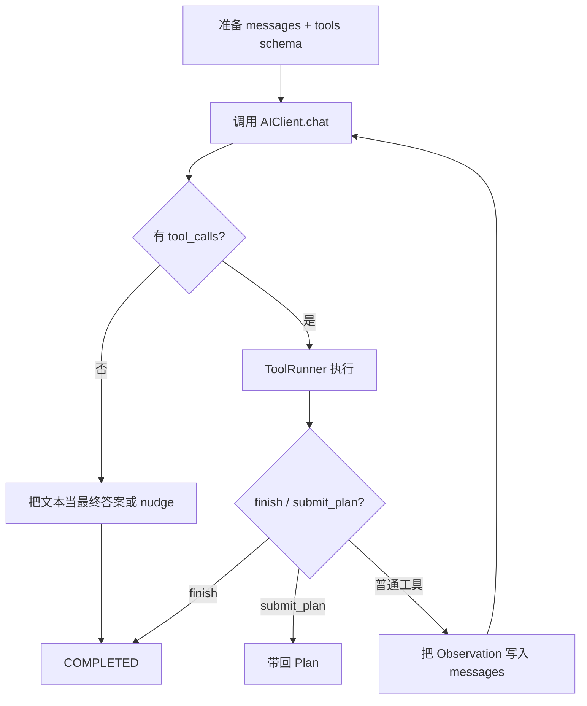

# Agent：热路径与 query_loop

`src/agent/` 是 SelfAgent 的「发动机」：对齐 Claude Code 一类产品的 QueryEngine / queryLoop——用模型的 **function/tool calls** 驱动工具，而不是解析自由文本里的 `Action:` 行。

## 你该记住的三个名字

| 名字 | 文件 | 作用 |
|------|------|------|
| `Agent` | `facade.py` | 对外门面：组装 skills / permission / MCP，提供 `run` / `plan` / `execute_plan` |
| `AgentEngine` | `engine.py` | 会话级提交：拼消息、调 `query_loop`、转成 `AgentResult` |
| `query_loop` | `loop.py` | 同步循环：调模型 → 跑工具 → 更新 `LoopState` → 直到终止 |

```python
from agent import Agent
from skills import SkillRegistry

agent = Agent(skills=SkillRegistry.from_config(), workdir=".", max_steps=12)
result = agent.run("查看当前目录")
print(result.answer, result.completed, result.steps)
```

## 循环在干什么



每一步大致包括：

1. **`prepare_messages`**：上下文管道（裁剪 / 标注等）。
2. **模型调用**：带上当前模式的 tools schema（内置 skill + MCP + `run_subagent` 等）。
3. **ToolRunner**：解析参数；`finish` / `submit_plan` / `enter_plan_mode` 特殊处理；其余交给 `SkillBridge`。
4. **Doom-loop**：检测重复失败或空转，必要时停止或注入提示。
5. **Stop hooks**：成功或失败终止时触发 Hooks 的 `Stop` / `StopFailure`。

## 工具 schema 从哪来

`build_schemas_for_mode` → `mcp.assemble_tool_pool`：

1. 内置 skill（经 permission 过滤）排在前面（利于 prompt cache）
2. 内置控制工具：`finish`、可选 `enter_plan_mode` / `submit_plan`、`run_subagent`
3. MCP 工具：`mcp__{server}__{tool}`

## 与其它模块的接点

- **session**：`RunControl` 取消、`AgentMode`、进度回调、`AgentResult` 类型。
- **permission**：每个 skill/MCP 调用前 `check`。
- **plan**：Plan Mode 下暴露规划工具；确认后 `execute_plan` 可走 workflow。
- **memory**：`AgentEngine` 可注入 `memory_service` 上下文。
- **hooks / subagent / mcp**：在 loop / bridge / spawn 中接线。

## 初学者实验

1. 跑 `examples/quickstart.py`，打开 `react.detail: summary` 看步骤。
2. 读 `tests/test_agent_loop.py`：用 `ScriptedAI` 假装模型返回固定 `tool_calls`，不耗 API。
3. 对比：旧 ReAct 文本解析已删除；现在 Observation 来自真实函数返回值。

下一步：[session.md](session.md)。
