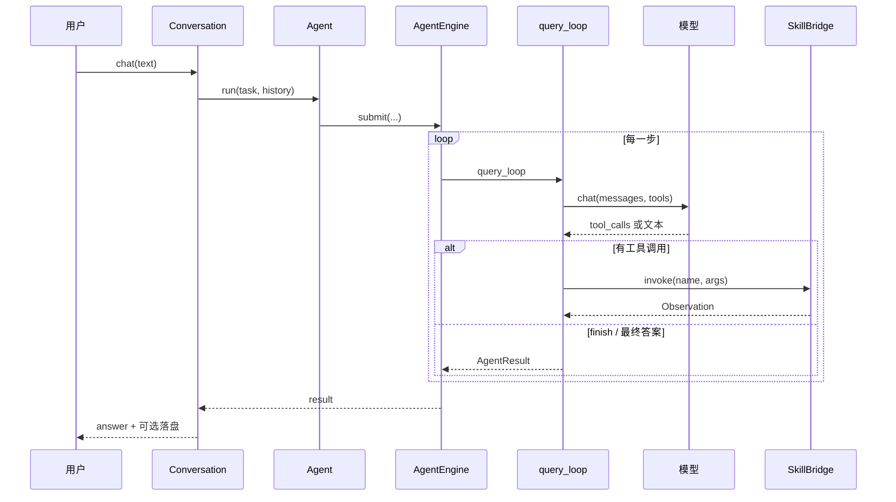

# 整体架构

SelfAgent **main** 是一个可嵌入的 Python 智能体核心：把用户任务交给大模型，模型通过 **原生 tool calls** 调用工具，框架负责权限、记忆、规划与扩展点。

## 分层一览

| 层 | 包 | 一句话 |
|----|-----|--------|
| 入口 | `session` | 多轮对话、取消、落盘 |
| 循环 | `agent` | 问模型 → 跑工具 → 再问，直到 `finish` |
| 模型 | `ai` | 统一 chat / tools 接口（如 DeepSeek） |
| 工具 | `skills` + `mcp` + `subagent` | 内置能力、外部 MCP、子代理 |
| 门禁 | `permission` + `hooks` | 规则鉴权 + 生命周期钩子 |
| 规划 | `plan` + `workflow` | Plan Mode 与确认后执行 |
| 记忆 | `memory` | 压缩历史、项目/会话笔记 |
| 观测 | `log` | 分级日志与 debug 通道 |

配置由根模块 `config` 加载（`config.yaml`）。Agent 相关配置仍写在 **`react:`** 节下（历史键名），代码包则是 `session` / `agent`。

## 一次 `chat` 发生了什么

要点：

1. **Conversation** 维护历史消息，并在超长时触发 **memory** 压缩。
2. **Agent / AgentEngine** 组装 system prompt、工具 schema、权限与 MCP。
3. **query_loop** 是唯一热路径：不再使用旧的「文本解析 Action:」ReAct 格式。
4. 工具执行前走 **permission**；Hooks 可在 PreToolUse 阶段 **exit 2 拦截**。

## 模式：Agent vs Plan

- **Agent Mode**：直接调用工具完成任务，结束时调用 `finish`。
- **Plan Mode**：只读调研，用 `submit_plan` 交出计划；用户确认后由 **workflow** 执行写入类步骤。

切换入口：`Agent(mode=...)`、`enter_plan_mode` 工具，或配置 `react.mode`。

## 产品线与本目录

| 分支 | 是否含本文档描述的核心 | UI |
|------|------------------------|-----|
| `main` | 是 | 无（库 / CLI 示例） |
| `web` / `app` | 同源核心 + 工作台 | 浏览器 / Electron |

学完架构后，建议接着读 [agent.md](agent.md)。
