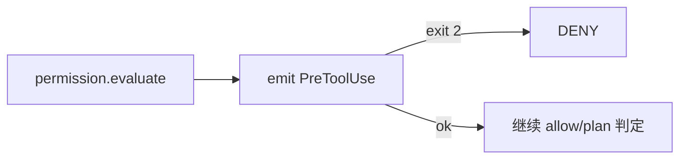

# Hooks：生命周期钩子

`src/hooks/` 提供可配置的扩展点：在用户提交、工具前后、停止、压缩、子代理、权限询问等时机，运行 **command / http / prompt** 脚本。

对齐 Claude Code 的 HookEvent 思路：类型表齐全；SelfAgent 在可触发面上接线。

## 事件（核心）

| 事件 | 典型触发点 |
|------|------------|
| `UserPromptSubmit` | `Conversation.chat` 入口 |
| `PreToolUse` | permission 流水线步骤 3 |
| `PostToolUse` / `PostToolUseFailure` | `SkillBridge` 执行后 |
| `Stop` / `StopFailure` | `query_loop` 终止 |
| `SubagentStart` / `SubagentStop` | `run_subagent` |
| `PreCompact` / `PostCompact` | `memory.compact` |
| `PermissionRequest` | 交互式 ask 前 |
| `SessionStart` / `SessionEnd` 等 | 可注册；无触发点时 no-op |
| `FileChanged` / `ConfigChange` / `Notification` | 占位 |

完整枚举：`hooks.events.HookEvent` / `ALL_HOOK_EVENTS`。

## Runner 类型

| runner | 行为 |
|--------|------|
| `command` | shell 执行；stdin 为 JSON payload；**exit code 2 = block（拦截）** |
| `http` | POST JSON；403/409 视为 block |
| `prompt` | 同 command，但把 stdout 作为附加上下文注入 |

不做 plugin / agent mini-query runner（无插件市场）。

## 配置

`config.yaml`：

```yaml
hooks:
  PreToolUse:
    - matcher: local_file   # 或 "*"
      runner: command
      command: 'python path/to/guard.py'
  Stop:
    - runner: command
      command: 'echo stopped'
```

也可写工作区 `.selfagent/hooks.yaml`。  
进程启动时可 `HookRegistry.from_config()` + `set_hook_registry(...)`（web 入口已做；库用法可自行调用）。

## PreToolUse 与权限



matcher 匹配 `tool_name`（skill 名或 `mcp__...`）。程序化 `guard.add_pre_tool_hook(...)` 仍可用，在 registry 之后执行。

## 初学者实验

1. 为 `local_file` 配一个始终 `sys.exit(2)` 的脚本，尝试 write，应看到权限/钩子拒绝。  
2. 阅读 `tests/test_hooks_full.py`、`tests/test_pre_tool_hook.py`。

相关：[permission.md](permission.md)、[agent.md](agent.md)。
