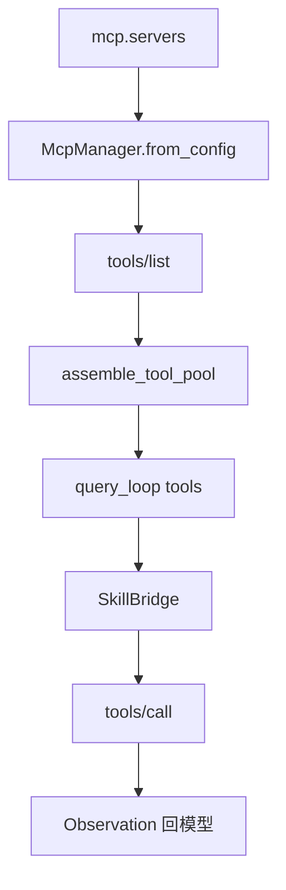

# MCP：外部工具池

`src/mcp/` 把 [Model Context Protocol](https://modelcontextprotocol.io/) 服务器上的工具，合并进 SelfAgent 的 tool schema，让模型像调用内置 Skill 一样调用它们。

当前实现重点：**stdio 传输**（子进程 JSON-RPC）。完整 OAuth / 企业连接器不在范围内。

## 模块

| 文件 | 职责 |
|------|------|
| `config.py` | 读 `config.yaml` → `mcp.servers` |
| `client.py` | `McpStdioClient` / `McpManager`：initialize、tools/list、tools/call |
| `pool.py` | `assemble_tool_pool`：skill schema + MCP schema |
| `types.py` | `McpServerConfig`、`McpToolDesc`、工具名解析 |

## 工具命名

对外统一为：

```text
mcp__{server}__{tool}
```

例如服务器名 `echo`、工具 `echo` → `mcp__echo__echo`。  
权限规则可写 `mcp__*` 或具体名。

## 组装与调用



1. `Agent` 启动时尝试连接已启用的 server。  
2. `build_schemas_for_mode` 经 `assemble_tool_pool` 把 MCP 工具接在内置 skill **之后**。  
3. `SkillBridge` 识别 `mcp__` 前缀并 `McpManager.call`。

## 配置示例

```yaml
mcp:
  servers:
    echo:
      transport: stdio
      command: python
      args: ["-m", "tests.fixtures.mcp_echo_server"]
      enabled: true
```

测试夹具：`tests/fixtures/mcp_echo_server.py`；用例：`tests/test_mcp_pool.py`。

在 `app`/`web` 产品线上还有 `GET /api/mcp`、`POST /api/mcp/reload`；**main** 核心库本身通过配置加载即可。

## 初学者注意

- 子进程要能被 `command` 直接启动；路径与环境用 `env` / `cwd`。
- 连接失败会打 warning，不阻断整个 Agent（该 server 的工具不会出现）。
- Plan Mode 下 MCP 仍受 permission / 只读策略约束。

相关：[skills.md](skills.md)、[agent.md](agent.md)、[permission.md](permission.md)。
