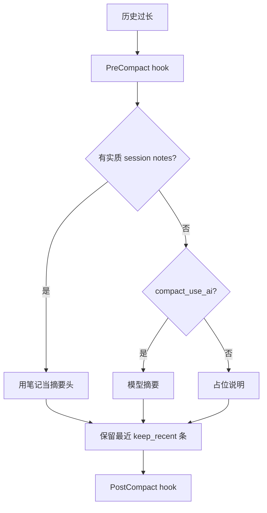

# Memory：记忆与上下文压缩

`src/memory/` 解决两件事：**对话太长怎么办**，以及 **跨轮/跨会话要记住什么**。

## 模块地图

| 模块 | 文件 | 作用 |
|------|------|------|
| `MemoryService` | `__init__.py` | 门面：注入上下文、回合后提取、系统节 |
| `compact_transcript` / `hard_trim` | `compact.py` | 超长历史压缩 |
| `SessionMemory` | `session.py` | 会话笔记（优先作压缩摘要） |
| `MemoryStore` | `store.py` | 文件型 MEMORY.md + topic |
| extract / inject / scan | 同名文件 | 提取、注入、扫描索引 |

配置节：`memory:`（见 `config.example.yaml`）。

## 压缩何时发生

`Conversation` 在消息数超过 `compact_after_messages` 时调用 `memory.compact`：

压缩会插入 `[上下文摘要]` 与可选 `[compact_boundary]`，避免旧 tool 轨迹无限膨胀。

## 文件型记忆

启用后，工作区下 `.selfagent/memory/`（或配置路径）存放：

- 总览 `MEMORY.md`
- 按主题拆分的笔记

`MemoryService.context_for(task)` 可在每轮开始把相关片段注入模型；`memory_ops` Skill 允许模型主动读写（受权限约束）。

## 和 Agent / Session 的关系

- **Session**：持有 messages，触发 compact。
- **AgentEngine**：可挂 `memory_service`，把 prefetch 文本放进 messages。
- **Hooks**：`PreCompact` / `PostCompact` 可观测或扩展。

## 初学者建议

1. 本地把 `memory.compact_after_messages` 调小，多聊几轮，观察 messages 是否出现摘要。
2. 阅读 `tests/test_memory_*.py`、`tests/test_compaction.py`。

下一步：[workflow.md](workflow.md)。
