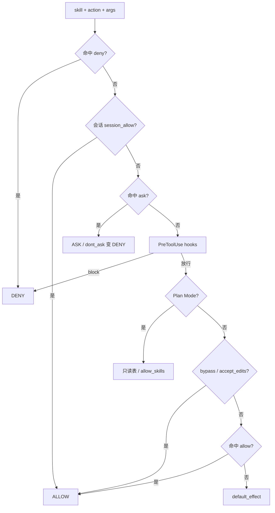

# Permission：权限流水线

`src/permission/` 决定 **每一个工具调用** 是放行、拒绝，还是先问用户（ask）。设计对齐 Claude Code 的「规则 + 模式 + 会话授权」思路。

## 入口

```python
from permission import PermissionGuard, PermissionMode

guard = PermissionGuard.from_config()           # 读 config.yaml → permission
# 或
guard = PermissionGuard.from_rules(
    allow=["local_file(list)", "local_file(read)"],
    ask=["local_file(write)"],
    deny=[],
    default_effect="deny",
)
decision = guard.check("local_file", arguments={"action": "write", "path": "a.txt"})
print(decision.allowed, decision.behavior, decision.reason)
```

- **`PermissionGuard`**（`guard.py`）：门面；持有 `PermissionContext`、可选 `ask_handler`。
- **`evaluate`**（`pipeline.py`）：真正的判定顺序。
- **规则语法**（`rules.py`）：`Skill` / `Skill(action)` / `Skill(prefix:*)` / `Skill(*)`，支持 `mcp__*` 通配。

## 判定顺序（务必理解）



要点：

1. **deny 优先**，且免疫 bypass。
2. **ask** 需要 `ask_handler`（CLI/Web）；放行后常 `grant_session(rule)`，本会话后续短路。
3. **Hooks PreToolUse**：command runner **exit 2** → DENY（见 [hooks.md](hooks.md)）。
4. **Plan Mode**：即使 `enabled=False` 也会强制只读门禁（产品安全）。

## 模式 `PermissionMode`

| 模式 | 含义 |
|------|------|
| `default` | 走完整规则 |
| `accept_edits` | 对编辑类更宽松（见 `modes.py`） |
| `plan` | 与 plan_active 协同只读 |
| `bypass` | 快速放行（仍受 deny / ask 约束处除外） |
| `dont_ask` | 把 ASK 变成 DENY |

## 与 Bridge / Agent

`SkillBridge.invoke` 调用 `guard.check`：

- `ALLOW` → 执行  
- `ASK` → `_resolve_ask` → 用户确认 → `grant_session`  
- `DENY` → 返回「权限拒绝: …」Observation，模型可改策略  

配置示例见 `config.example.yaml` → `permission.rules`。

下一步：[plan.md](plan.md) 或 [hooks.md](hooks.md)。
