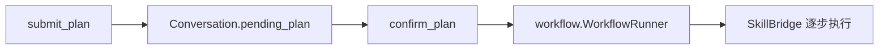

# Plan：先规划再执行

`src/plan/` 实现 Plan Mode：模型先 **只读调研**，用 `submit_plan` 提交步骤清单，用户确认后再执行写入类操作。

## 为什么需要 Plan Mode

直接 Agent Mode 可能边想边改文件。Plan Mode 把「调研」和「改动」拆开：

1. 进入 Plan（构造 `mode=plan` 或工具 `enter_plan_mode`）
2. 只读工具探测（list/read/search…）
3. `submit_plan` 产出 `Plan`（summary + steps）
4. 用户 `confirm_plan` → **workflow** 按步执行

## 关键类型与文件

| 符号 | 文件 | 作用 |
|------|------|------|
| `Plan` / `PlanStep` | `model.py` | 计划数据结构与文本格式化 |
| `PlanLifecycle` | `lifecycle.py` | enter / submit / confirm / reject 状态 |
| `PlanStore` | `store.py` | 计划落盘（`.selfagent/plans/`） |
| prompts / tools | `prompts.py` / `tools.py` | Plan 系统提示、是否暴露 submit/enter |

## 工具

- **`enter_plan_mode`**：从 Agent Mode 切入只读规划（可选 reason）。
- **`submit_plan`**：参数含 `summary`、`steps[{skill,input,why}]`。

Plan Mode 下 **permission** 用 `readonly_actions` + `plan_allow_skills` 硬拦截写入（见 `react.plan` 配置）。

## 确认之后



`Agent.execute_plan(plan)` 会把计划转成 WorkflowRun 并同步执行（错误策略可 stop/continue）。

## 初学者怎么试

```python
from agent import Agent
from session import AgentMode

planner = Agent(mode=AgentMode.PLAN, workdir=".")
pr = planner.plan("给项目加一个小脚本说明")
print(pr.plan.format_text())
# 确认后：
# Agent(mode=AgentMode.AGENT).execute_plan(pr.plan)
```

或看 `tests/test_plan_mode.py`、`tests/test_plan_lifecycle.py`、`tests/test_enter_plan_mode.py`。

下一步：[memory.md](memory.md)、[workflow.md](workflow.md)。
