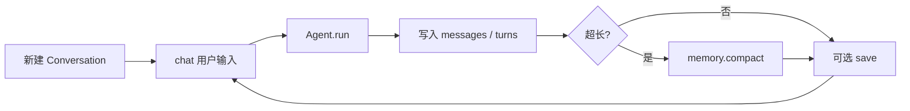

# Session：连续对话与运行控制

`src/session/` 负责「一次任务之外」的状态：多轮消息、取消、展示细节、模式枚举，以及 Conversation 落盘。

## 核心类型

| 符号 | 文件 | 含义 |
|------|------|------|
| `Conversation` | `conversation.py` | 多轮 `chat` / `confirm_plan` / `save` / `load` |
| `RunControl` | `control.py` | 取消当前 turn、中途 `enqueue` 插话 |
| `AgentMode` | `mode.py` | `agent` / `plan` |
| `DoomLoopTracker` | `doom_loop.py` | 重复工具调用 / 连续失败防护 |
| `AgentResult` / `AgentStep` | `types.py` | 一轮结果与步骤（Thought / calls / Observation） |
| detail / changes | `detail.py` / `changes.py` | 过程细节文本、文件变更摘要 |

`session.__init__` 用惰性导入暴露 `Agent`、`Plan`、`Conversation` 等，方便 `from session import Conversation, Agent`。

## Conversation 生命周期



典型用法：

```python
from session import Conversation
from agent import Agent

conv = Conversation(Agent(workdir="."), persist_dir="logs/sessions")
print(conv.chat("先列出文件").answer)
print(conv.chat("根据刚才结果读 README").answer)  # 带历史
conv.cancel()  # 请求结束当前 turn（协作式）
```

行为要点：

- **历史**：`messages` 列表（system / user / assistant / tool）。
- **UserPromptSubmit hook**：`chat` 入口可被 Hooks 附加上下文或拦截。
- **落盘**：默认目录 `logs/sessions/`，支持 `resolve_session_path("latest")` 恢复。
- **Plan**：`pending_plan` / `confirm_plan` / `reject_plan` 与 plan 生命周期协作。

## RunControl（取消与插话）

循环每步检查 `control.cancel_requested`；用户可在 Web/CLI 上点取消。  
`enqueue(text)` 把补充说明排到下一步注入（「中途插话」）。

## 过程细节

配置 `react.detail`：`off` | `summary` | `full`。  
也可 `agent.set_detail("full")`。细节用于日志/UI，不改变模型协议。

## 和 Agent 的边界

- **session**：对话容器、控制旋钮、展示类型。
- **agent**：真正的模型循环与工具执行。

初学者可先只玩 `Conversation.chat`，再深入 [agent.md](agent.md)。  
下一步常读：[skills.md](skills.md)、[permission.md](permission.md)。
