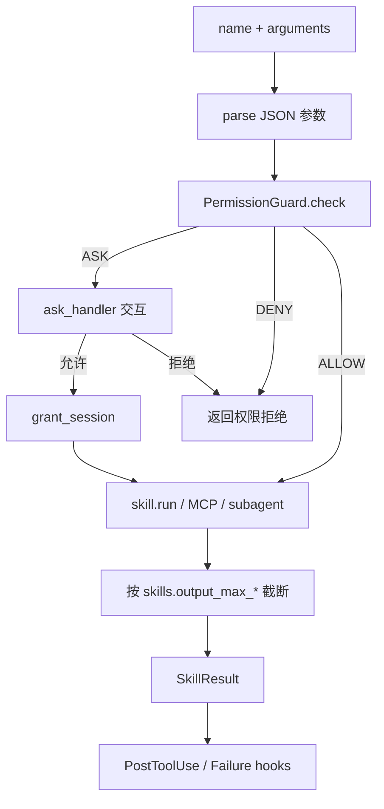

# Skills：内置工具层

`src/skills/` 把「模型能调用的能力」做成统一接口：每个 Skill 有名字、描述、JSON Schema，执行后返回 `SkillResult`。

## 三个关键件

| 类 | 文件 | 作用 |
|----|------|------|
| `Skill` / `SkillResult` | `base.py` | 工具基类与返回值（`ok` / `output` / `data`） |
| `SkillRegistry` | `registry.py` | 注册、按配置启用、`from_config()`、设 workdir |
| `SkillBridge` | `bridge.py` | 统一 `invoke`：解析参数 → 权限 → 执行 → 截断输出 |

Agent 不直接 `skill.run()`，而是：

```text
query_loop → ToolRunner → SkillBridge.invoke(name, args)
```

Bridge 还会路由 **MCP**（`mcp__*`）和 **`run_subagent`**。

## 一次 invoke



## 常用内置 Skill（摘要）

| 名称 | 典型用途 |
|------|----------|
| `local_file` | list / read / write / patch / move |
| `search_code` | 项目内搜索 |
| `shell_run` | 白名单命令 |
| `git_ops` | status / diff / log；可选 add/commit |
| `ask_user` | 向用户提问（可暂存批量确认） |
| `nodejs` / `python` / `csharp` | 语言工具链 |
| `web_fetch` / `http_request` | 抓取与 HTTP（默认禁内网） |
| `todo_tracker` | 步骤清单 |
| `memory_ops` | 读写文件型记忆 |
| `browser` / `screenshot` | 可选依赖 |

完整列表与参数见 [`config.example.yaml`](../config.example.yaml) 的 `skills:` 与各 skill 源码。

## 工作目录

`Agent(workdir=...)` / `set_workdir` 会同步到带 `root` 的 Skill（文件、搜索、shell、git 等），避免模型乱写仓库外路径。

## 扩展一个 Skill

1. 继承 `Skill`，实现 `name`、`description`、`parameters_schema`、`run(**kwargs)`。
2. `registry.register(YourSkill())` 或在 `SkillRegistry.from_config` 中挂载。
3. 在 `permission.rules.allow` 中放行对应规则。

下一步：[permission.md](permission.md)。
