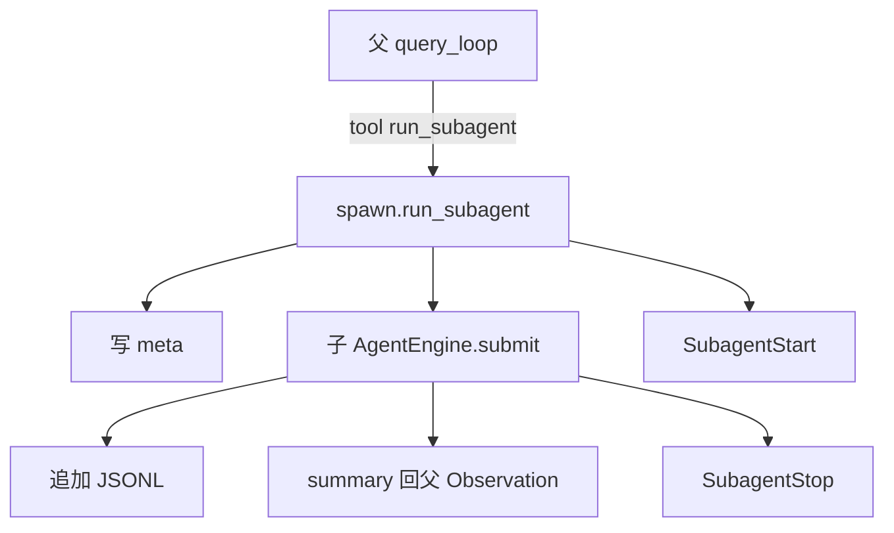

# Subagent：子代理与 Sidechain

`src/subagent/` 让父 Agent 通过工具 **`run_subagent`** 拉起一个 **隔离的子循环**：独立 `RunControl`、独立 transcript，结果摘要回到父消息。

不做 worktree / 远程 / swarm（高级能力留给后续）。

## 文件职责

| 文件 | 职责 |
|------|------|
| `spawn.py` | `run_subagent(...)`：建 id、写 meta、调 `AgentEngine.submit` |
| `transcript.py` | sidechain JSONL + `.meta.json` |
| `resume.py` | 按 `agent_id` 读历史以便续跑 |
| `context.py` | 继承 workdir、只读 memory / 父摘要 |

## 调用方式

模型（或测试）发起：

```json
{
  "name": "run_subagent",
  "arguments": {
    "prompt": "只负责调研 API 用法并总结",
    "description": "调研",
    "max_steps": 8,
    "agent_id": "可选-续跑同一 sidechain"
  }
}
```

`SkillBridge` 绑定父级 `ai` / `skills` / `permission` / `session_id` 后执行；子引擎默认 **不再嵌套** `run_subagent`（防递归爆炸）。

## Sidechain 落盘

```text
logs/sessions/{session_id}/subagents/
  agent-{id}.jsonl      # 消息流
  agent-{id}.meta.json  # agentType / description / parent / workdir
```



进度事件（供 UI）：`subagent_start` / `subagent_progress` / `subagent_stop`。

## Resume

再次调用并传入同一 `agent_id`：先 `load_messages`，再跑新 `prompt`，JSONL **追加** 而非覆盖。见 `tests/test_subagent.py`。

## 何时用

- 子任务边界清晰（调研、单一模块修改说明）。
- 希望父上下文不被子过程刷屏，又要保留可审计轨迹。

相关：[agent.md](agent.md)、[session.md](session.md)、[hooks.md](hooks.md)。
