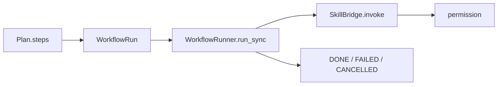

# Workflow：编排与计划执行

`src/workflow/` 在 Agent 之上做 **多步骤编排**：把已确认的 Plan、YAML 工作流、队列任务变成可追踪的 Run。

## 什么时候用到

- 用户 **确认 Plan** 后：`Conversation.confirm_plan` → `WorkflowRunner` 逐步调 Skill。
- 将来的斜杠命令 / cron / 后台队列（`CommandRegistry`、`CronScheduler`、`WorkflowQueue`）。

它 **不替代** `query_loop`：推理仍在 agent；workflow 负责「按图执行已知步骤」。

## 关键组件

| 组件 | 文件 | 作用 |
|------|------|------|
| `WorkflowRunner` | `runner.py` | 同步执行 `WorkflowRun`（依赖 / 错误策略 / 取消） |
| `WorkflowRun` / 步骤状态 | `types.py` | 运行时状态机 |
| `plan_to_workflow_run` | （经 `__init__` / runner） | Plan → Run |
| `CommandRegistry` | `registry.py` | `/command` 与 workflow 定义 |
| `WorkflowQueue` / workers / cron | `queue.py` 等 | 异步与定时扩展 |

落盘目录默认在 `.selfagent/workflows/`（可配）。

## 确认计划的数据流

每步对应一个 skill + input；失败时可 `on_error=stop|continue`。进度可通过 `on_progress` 冒泡到 UI。

## 和 Plan / Agent

- **plan**：产出结构化步骤。
- **agent.execute_plan**：内部构造 Runner（可注入 `agent_factory` 以嵌套能力）。
- **permission**：执行期通常已退出 `plan_active`，但仍走正常 allow/deny。

## 初学者

先走通「Plan Mode → confirm → 文件被写入」，再读 `tests/test_workflow_*.py`。  
不必一上来就配置 cron。

相关文档：[plan.md](plan.md)、[agent.md](agent.md)。
